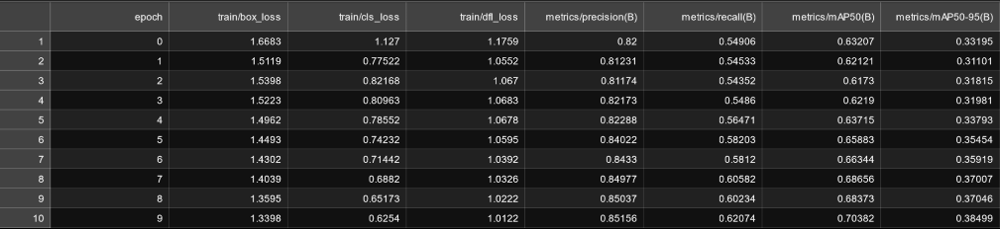

# Usage of the [yolov8](https://github.com/ultralytics/ultralytics) model in different ways (Face detection)


[](https://colab.research.google.com/drive/1K0qnljZY0xhhYVE0NmBWBSyF5tGF9d6y?usp=sharing)

YOLOv8🔥has been released by Ultralytics (10th, Jan 2023).

It has provided advancements in computer vision that have brought about a massive novelty in the way we perceive,<br>
analyze, and understand the visual world. It will allow for unprecedented possibilities in various fields.

Considerable improvements have been made in terms of speed, accuracy, and architecture. Its implementation is <br>
done from scratch, and no major modules (i.e model architecture) have been used from YOLOv5. It is faster in <br>
speed and more accurate than its previous version (YOLOv7), and it has achieved a new high in terms of <br>
Mean Average Precision (MAP) with a score of 53.7.

## Training object detection model

### Dataset

We use [WiderFace dataset](http://shuoyang1213.me/WIDERFACE/) for face detection<br>
First, prepare dataset for training. Training folder should look like this:

```
--- dataset folder
|    |--- train
|    |    |--- images
|    |    |--- labels
|    |--- valid
|    |    |--- images
|    |    |--- labels
```

### <span style="color:red">Run Data preprocessing.ipynb to do the above</span>

Dataset yaml file will be as follows:
data.yaml

```
path: dataset folder
train: train/images
val: valid/images

nc = 1
names: ['face']
```

Training process based on the above dataset:

```
.\run.sh
```

Train results as follows:<br>
<a></a>

### Models

Trained models [here](https://drive.google.com/drive/folders/1AQFq_Rizt5sdk5KVVbqr4hDPnx9otp9C?usp=sharing).

## Deploy model

- Run Deploy models.ipynb<br>
  or
- [](https://colab.research.google.com/drive/1K0qnljZY0xhhYVE0NmBWBSyF5tGF9d6y?usp=sharing)

## Installation

To install the latest official release:

1. Install python

- requirement version 3.9

2. Create virtual environment

- pip install virtualenv
- python -m venv {name of virtual environment}
- activate it<br>
- path to your env/bin/activate

3. `pip install -r requirements.txt`

## Requirements

- OS:<br>
  Linux (ubuntu 20.04)
- GPU:<br>
  Nvidia GeForce RTX 3060 Lite Hash Rate
